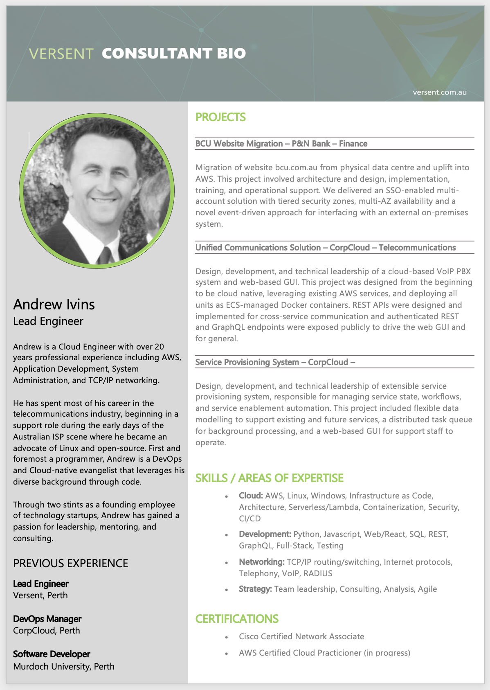

# biogen

Generate your versent bio from YAML using the latest template

## Synopsis

Given a YAML file with the required fields and a portrait.jpg, running `biogen` will generate a Versent Bio in Word format from a built-in template.

```
$ tree mybio
mybio
├── biogen.yaml
└── portrait.jpg

$ cd mybio
$ biogen
$ file 'Andrew Ivins Bio.docx'
Andrew Ivins Bio.docx: Microsoft OOXML
```

Output file looks like this:

<p align="center">

</p>

## Installing

To install globally:

```
pip3 install https://github.com/andrewivins/biogen/archive/master.tar.gz 
```

`biogen` should now be on your $PATH to run from anywhere.